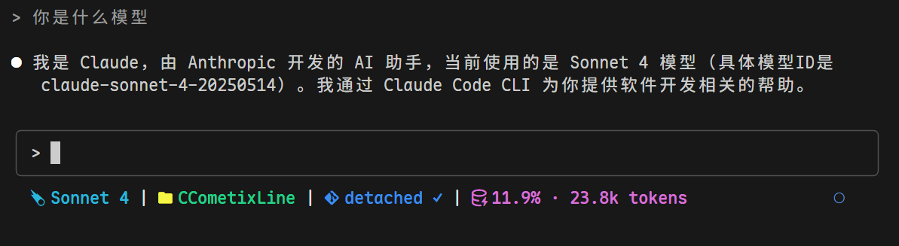

# CCometixLine

基于 Rust 的高性能 Claude Code 状态栏工具，集成 Git 信息和实时使用量跟踪。


## 截图



状态栏显示：模型 | 目录 | Git 分支状态 | 上下文窗口信息

## 特性

- **高性能** Rust 原生速度
- **Git 集成** 显示分支、状态和跟踪信息
- **模型显示** 简化的 Claude 模型名称
- **使用量跟踪** 基于转录文件分析  
- **目录显示** 显示当前工作空间
- **简洁设计** 使用 Nerd Font 图标
- **简单配置** 通过命令行选项配置

## 安装

从 [Releases](https://github.com/Haleclipse/CCometixLine/releases) 下载：

```bash
# 下载并安装
wget https://github.com/Haleclipse/CCometixLine/releases/latest/download/ccline-linux-x64.tar.gz
tar -xzf ccline-linux-x64.tar.gz
mkdir -p ~/.claude/ccline
cp ccline ~/.claude/ccline/
```

或从源码构建：

```bash
git clone https://github.com/Haleclipse/CCometixLine.git
cd CCometixLine
cargo build --release
cp target/release/ccometixline ~/.claude/ccline/ccline
```

添加到 Claude Code `settings.json`：

```json
{
  "statusLine": {
    "type": "command", 
    "command": "~/.claude/ccline/ccline",
    "padding": 0
  }
}
```

## 使用

```bash
# 基础使用 (显示所有启用的段落)
ccline

# 显示帮助
ccline --help

# 打印默认配置
ccline --print-config

# TUI 配置模式 (计划中)
ccline --configure
```

## 默认段落

显示：`目录 | Git 分支状态 | 模型 | 上下文窗口`

### Git 状态指示器

- 带 Nerd Font 图标的分支名
- 状态：`✓` 清洁，`●` 有更改，`⚠` 冲突
- 远程跟踪：`↑n` 领先，`↓n` 落后

### 模型显示

显示简化的 Claude 模型名称：
- `claude-3-5-sonnet` → `Sonnet 3.5`
- `claude-4-sonnet` → `Sonnet 4`

### 上下文窗口显示

基于转录文件分析的令牌使用百分比，包含上下文限制跟踪。

## 配置

计划在未来版本中支持配置。当前为所有段落使用合理的默认值。

## 性能

- **启动时间**：< 50ms（TypeScript 版本约 200ms）
- **内存使用**：< 10MB（Node.js 工具约 25MB）
- **二进制大小**：约 2MB 优化版本

## 要求

- Git（可选，用于 Git 集成）
- 支持 Nerd Font 的终端
- Claude Code 用于状态栏集成

## 开发

```bash
# 构建开发版本
cargo build

# 运行测试
cargo test

# 构建优化版本
cargo build --release
```

## 路线图

- [ ] TOML 配置文件支持
- [ ] TUI 配置界面
- [ ] 自定义主题
- [ ] 插件系统
- [ ] 跨平台二进制文件

## 贡献

欢迎贡献！请随时提交 issue 或 pull request。

## 许可证

本项目采用 [MIT 许可证](LICENSE)。

## Star History

[](https://star-history.com/#Haleclipse/CCometixLine&Date)